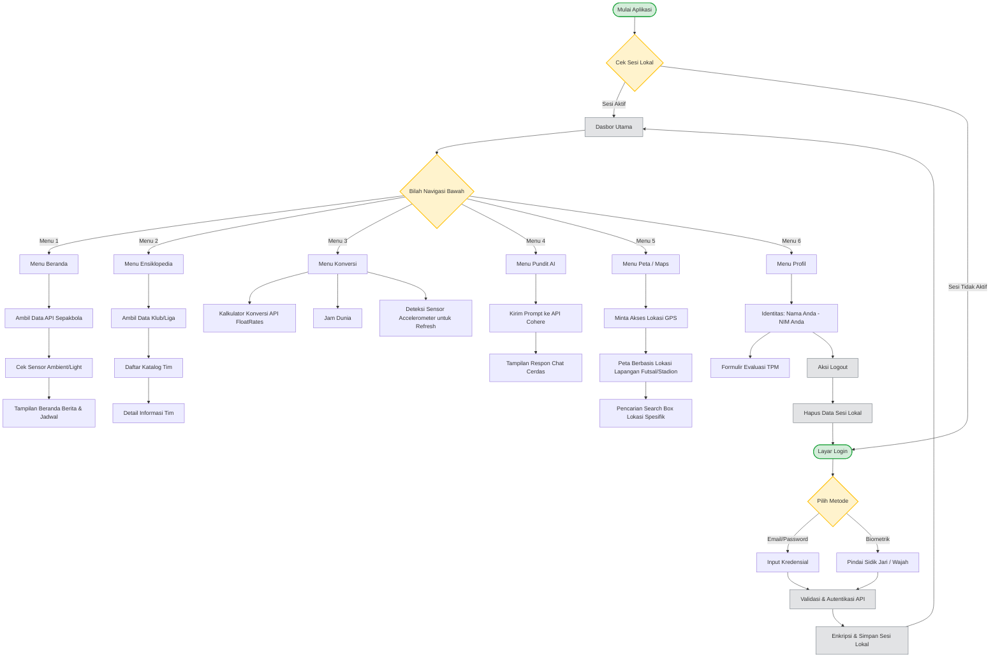

# Flowchart Aplikasi FootyHub

Dokumen ini berisi struktur visual diagram **Flowchart** dari alur sistem aplikasi FootyHub. Struktur ini dibuat identik dengan pola dari referensi (*flowcharttugasaakhir.drawio*) namun disesuaikan fiturnya untuk kasus FootyHub.

> **Cara Menggunakan ke dalam Draw.io:**
> 1. Salin (Copy) kode yang ada di dalam blok kode `mermaid` di bawah ini (Mulai dari baris `graph TD` hingga akhir).
> 2. Buka **app.diagrams.net** (Draw.io).
> 3. Pilih menu **Arrange** > **Insert** > **Advanced** > **Mermaid...**
> 4. Tempel (Paste) kode tersebut ke dalam kotak teks yang muncul, lalu tekan **Insert**.
> 5. Flowchart otomatis akan terbuat secara instan dan dapat Anda sesuaikan posisinya.

